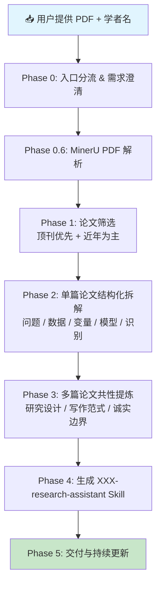

# 🧬 keyan · 科研女娲

> 经济学实证论文 Skill 生成工作台 —— 输入学者姓名 + 论文 PDF，自动蒸馏科研范式，生成可运行的 AI 科研助理。

[](https://opensource.org/licenses/MIT)

---

## 📖 这是什么？

**keyan（科研女娲）** 是一个面向经济学研究的 AI Skill 生成系统。它的核心能力是：

> 给定一位经济学家（或研究主题）的一批论文 PDF，自动提炼其研究范式，并生成一个专属的 `XXX-research-assistant` Skill。

生成后的 Skill 可以直接在支持 Copilot 的 AI 编辑器中使用，辅助你进行：

- 📄 论文阅读与结构化拆解
- 🔍 选题诊断与研究方向定位
- 📊 数据、变量与模型设计
- 🧪 识别策略评估（DID / FE / IV / 事件研究 等）
- 🛡️ 稳健性、机制与异质性检验设计
- ✍️ 论文写作（Introduction、文献综述、结果解释）
- 🎤 组会汇报与答辩 Q&A 准备
- 👀 审稿人视角的批判性修改

---

## 🚀 快速开始（部署）

### 前置条件

| 项目 | 要求 |
|---|---|
| AI 编辑器 | VS Code + GitHub Copilot（或支持 Copilot Skill 的编辑器） |
| Python | 3.9+（仅 PDF 解析脚本需要） |
| MinerU API Token | [免费申请](https://mineru.net/apiManage)（PDF 精准解析用） |

### 安装方式

三种方式任选其一：

**方式一：Claude Code（推荐 — 符号链接，修改即时生效）**

```bash
# 1. 克隆到任意位置（或直接使用已有仓库）
git clone https://github.com/ShenzhenLime/keyan.git

# 2. 创建目录联结，放入 Claude Code 全局 skills 目录
mkdir -p ~/.claude/skills
# Windows PowerShell:
New-Item -Path "$env:USERPROFILE\.claude\skills\keyan" -ItemType Junction -Target "你的keyan路径"
# macOS / Linux:
ln -s /path/to/keyan ~/.claude/skills/keyan

# 3. 安装依赖
cd keyan
pip install -r requirements.txt
```

联结后，原目录和 `~/.claude/skills/keyan/` 双向同步，修改代码即时生效，无需复制。

**方式二：跟 Agent 说一句话**

对 Claude / Copilot / Opencode 说：

> 帮我把 https://github.com/ShenzhenLime/keyan 整个仓库克隆下来，作为一个完整文件夹放到 skills 目录中。不要只复制 SKILL.md，要把整个 keyan/ 文件夹（含 skills/、README.md、requirements.txt 等所有内容）都放进去。

**方式三：手动克隆到 IDE skills 目录**

```bash
# OpenCode
cd C:\Users\27522\.config\opencode\skills

# VS Code + Copilot → 项目根目录的 .github/copilot/ 或 .copilot/
# cd 你的项目/.github/copilot

git clone https://github.com/ShenzhenLime/keyan.git
cd keyan
pip install -r requirements.txt
```

安装完成后目录结构：

```text
skills/
└── keyan/                        ← 整个仓库作为一个 Skill 文件夹
    ├── SKILL.md                  ← 主 Skill（科研女娲工作台）
    ├── README.md
    ├── requirements.txt
    ├── skills/
    │   ├── pdf-parse/            ← PDF 解析工具 Skill
    │   │   ├── SKILL.md
    │   │   └── pdf_to_md.py     ← MinerU PDF 批量解析
    │   └── liguangzhong-research-assistant/
    │       ├── SKILL.md          ← 示例：李广众科研助理 Skill
    │       └── references/       ← 中间产物（语料、拆解、综合）
    ├── data/                     ← 共享数据
    └── test/                     ← 测试用例
```

> ⚠️ 是 `skills/keyan/SKILL.md`，不是 `skills/SKILL.md`。整个仓库作为一个完整的 Skill 文件夹放进去。

配置好 MinerU Token（见下方 ⚙️ 配置章节），重启编辑器即可使用。

---

## 🔄 工作流程

本 Skill 包含 **6 个阶段**，从原始 PDF 到可运行的科研助理 Skill：



### 各阶段说明

| 阶段 | 做什么 | 产物 |
|---|---|---|
| **Phase 0** | 澄清需求（学者/主题/用途）+ PDF 预处理 | 结构化 Markdown 论文 |
| **Phase 1** | 论文筛选（顶刊优先、时间覆盖、主题均衡） | `paper-selection.md` |
| **Phase 2** | 单篇论文 13 维度拆解（X/Y/M、数据、模型、识别、写作DNA） | `paper-XXX.md` × N 篇 |
| **Phase 3** | 跨论文共性提炼（稳定范式 / 倾向性模式） | `01-研究设计.md` `02-写作范式.md` `03-诚实边界.md` |
| **Phase 4** | 组装生成可运行的 `XXX-research-assistant/SKILL.md` | 最终 Skill 文件 |
| **Phase 5** | 交付说明 + 增量更新机制 | 持续维护 |

> 📌 **PDF 解析**使用 [MinerU](https://mineru.net/) 精准解析 API，可将论文 PDF 转为结构化 Markdown（含公式、表格、图表）。

---

## 📂 目录结构

安装后的目录结构（以 OpenCode 为例）：

```text
skills/
└── keyan/                       ← 🧬 整个仓库作为一个 Skill 文件夹
    ├── SKILL.md                 ← 主 Skill（科研女娲工作台）
    ├── README.md                ← 📖 本文件
    ├── requirements.txt         ← Python 依赖
    ├── skills/
    │   ├── pdf-parse/           ← 🔧 PDF 解析工具 Skill
    │   │   ├── SKILL.md
    │   │   └── pdf_to_md.py    ← MinerU PDF 批量解析
    │   └── liguangzhong-research-assistant/
    │       ├── SKILL.md         ← 📦 示例：李广众科研助理 Skill
    │       └── references/      ← 📋 中间产物（语料、拆解、综合）
```

---

## 📦 Python 外部包

PDF 解析脚本 `skills/pdf-parse/pdf_to_md.py` 依赖以下外部包：

| 包名 | 用途 |
|---|---|
| `requests` | HTTP 请求（MinerU API 调用、文件上传/下载） |

### 安装方式

```bash
pip install -r requirements.txt
```

或直接安装：

```bash
pip install requests
```

---

## ⚙️ PDF 解析脚本

`skills/pdf-parse/pdf_to_md.py` 已封装为 Agent 友好 API，同时保留 CLI 入口。

### 方式一：CLI 调用

```bash
python skills/pdf-parse/pdf_to_md.py --pdf-dir "C:/papers" --out-dir "C:/output"
# 可选：--token <token>  --model vlm  --batch-max 50  --quiet
```

### 方式二：Agent / Python 代码调用（推荐）

```python
from pdf_to_md import parse_pdfs, parse_single_pdf

# 批量解析整个文件夹
results = parse_pdfs(pdf_dir="C:/papers", out_dir="C:/output")
# 返回 list[dict]: pdf_name, status, output_dir, md_count, img_count, error

# 单文件解析
result = parse_single_pdf(pdf_path="C:/papers/xxx.pdf", out_dir="C:/output")
```

### 参数说明

| 参数 | 说明 | 默认值 |
|---|---|---|
| `pdf_dir` / `pdf_path` | PDF 路径 | 必填 |
| `out_dir` | 输出目录 | 必填 |
| `token` | MinerU API Token（不传则读 `M_TOKEN` 环境变量） | `os.getenv("M_TOKEN")` |
| `model_version` | 解析模型（`vlm` / `pipeline` / `MinerU-HTML`） | `vlm` |
| `batch_max` | 单次批量上限（API 限制 50） | 50 |
| `poll_interval` | 轮询间隔（秒） | 5 |
| `poll_timeout` | 轮询超时（秒） | 1800 |
| `verbose` | 是否打印进度 | True |

### Agent 调用注意事项

脚本头部已记录完整的踩坑经验，关键点：

- **不要减小 `batch_max`**：200 个文件以内用默认 50 一把梭最稳，减小反而会导致分批过多被 shell 超时 kill
- **429 重试即可**：遇到限流错误直接重跑，不是代码问题
- **单文件先测连通性**：不确定 API 是否可用时先调 `parse_single_pdf`

> ⚠️ 使用前请先到 [MinerU API 管理](https://mineru.net/apiManage) 申请 Token，并设为环境变量 `M_TOKEN`。

---

## 🎯 已生成的 Skill 示例

| Skill 名称 | 学者 | 论文数 | 覆盖领域 |
|---|---|---|---|
| `liguangzhong-research-assistant` | 李广众 | 15 篇（精选自 ~60 篇） | 汇率与国际金融、公司金融与治理、政府治理与税收、法与金融、资本市场 |

触发词示例：「李广众」「李广众论文」「按李广众的方式看这个选题」「用李广众 skill 帮我改论文」

---

## 🤝 贡献与扩展

欢迎基于本项目蒸馏更多学者的科研助理 Skill：

1. Fork 本仓库
2. 准备目标学者的论文 PDF
3. 运行解析脚本：
   ```bash
   python skills/pdf-parse/pdf_to_md.py --pdf-dir "<PDF文件夹>" --out-dir "<输出目录>"
   ```
4. 对 Claude / Copilot 说「基于这些论文生成 XXX 的科研助理 Skill」
5. 提交 PR 将生成的 `skills/XXX-research-assistant/` 分享给社区

---

## 📜 License

MIT License

---

## 🙏 致谢

- [MinerU](https://mineru.net/) — PDF 精准解析
- [GitHub Copilot](https://github.com/features/copilot) — AI Skill 运行环境
