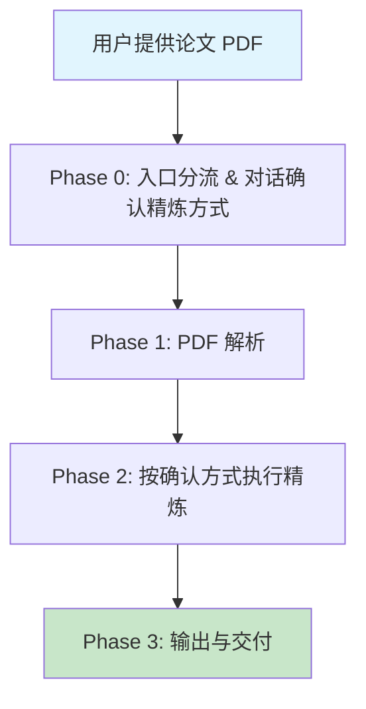

# 📄 refine_paper · 文献精炼工作台

> 对话驱动的文献精炼工具 —— 用户提供论文 PDF，通过对话确认精炼方式，按确认的方式对文献进行精炼输出。
>
> 精炼方式不是预设的，而是在对话中与用户共同确定。包括但不限于：单篇深度拆解、研究范式蒸馏、方法论提取、文献脉络梳理、研究缺口识别等。

[](https://opensource.org/licenses/MIT)

---

## 📖 这是什么？

**refine_paper** 是一个对话驱动的文献精炼工具。它的核心能力是：

> 用户提供一批论文 PDF，通过对话确认精炼方式，按确认的方式对文献进行精炼输出。

支持的精炼方式包括：

- 📄 单篇深度拆解
- 🔬 研究范式蒸馏（需满足触发条件）
- 🧪 方法论提取
- 🗺️ 文献脉络梳理
- 🔍 研究缺口识别
- 🧩 理论框架整合
- ⚖️ 实证策略对比
- 📊 结论综合

---

## 📜 版本历史

### v0.3 — refine_paper（当前版本）

**核心变化**：从"蒸馏学者"变为"对话驱动的文献精炼"。

- **重命名**：keyan（科研女娲）→ refine_paper（文献精炼工作台）
- **精炼方式由对话确认**：不再预设蒸馏路径，而是先读取论文、报告概况，再与用户对话确认精炼方式
- **8 种精炼方式**：单篇深度拆解、研究范式蒸馏、方法论提取、文献脉络梳理、研究缺口识别、理论框架整合、实证策略对比、结论综合
- **公司金融蒸馏模板加触发条件**：`templates/corporate-finance.md` 仅在论文属于公司金融领域 + 同一作者（或用户明确要求蒸馏）时才可使用
- **简化流程**：从 6 个 Phase 精简为 4 个（入口分流 → PDF 解析 → 执行精炼 → 输出交付）
- **保留 pdf-parse 独立 skill**：PDF 解析能力不变

### v0.2 — 通用化分流

**核心变化**：从公司金融专用工具变为支持多领域的通用工作台。

- **领域检测**：Phase 0 新增领域判断，根据论文特征自动识别研究领域
- **模板分流**：公司金融使用专用蒸馏模板，其他领域使用通用框架模板
- **新增 `templates/` 目录**：存放领域专用蒸馏模板
- **新增 `templates/corporate-finance.md`**：公司金融领域完整蒸馏模板（治理机制、融资约束、企业异质性等）
- **新增 `templates/generic-framework.md`**：通用框架模板（用户需修改占位符）

### v0.1 — keyan（科研女娲）

**核心变化**：项目初始版本，聚焦公司金融领域的学者蒸馏。

- **完整蒸馏流程**：从 PDF 解析到生成 `XXX-research-assistant` Skill 的 5 阶段工作流
- **公司金融深度支持**：内置公司金融特有的研究对象、X/Y/M 类型、数据来源、识别策略
- **PDF 解析**：调用 MinerU API 将 PDF 转为结构化 Markdown
- **论文筛选**：顶刊优先 + 近年为主 + 历史点缀
- **单篇 13 维度拆解**：元信息、一句话摘要、研究问题、数据、变量、模型、识别、结果、稳健性、机制、异质性、可学习性、置信度
- **共性提炼**：从多篇论文中提取研究设计、写作范式、诚实边界
- **生成可运行的 Skill**：输出包含完整工作流的 `SKILL.md`

---

## 🚀 快速开始（部署）

### 前置条件

| 项目             | 要求                                                      |
| ---------------- | --------------------------------------------------------- |
| AI 编辑器        | VS Code + GitHub Copilot（或支持 Copilot Skill 的编辑器） |
| Python           | 3.9+（仅 PDF 解析脚本需要）                               |
| MinerU API Token | [免费申请](https://mineru.net/apiManage)（PDF 精准解析用）   |

### 安装方式

三种方式任选其一：

**方式一：Claude Code（推荐 — 符号链接，修改即时生效）**

```bash
# 1. 克隆到任意位置（或直接使用已有仓库）
git clone https://github.com/ShenzhenLime/keyan.git

# 2. 创建目录联结，放入 Claude Code 全局 skills 目录
mkdir -p ~/.claude/skills
# Windows PowerShell:
New-Item -Path "$env:USERPROFILE\.claude\skills\keyan" -ItemType Junction -Target "你的keyan路径"
# macOS / Linux:
ln -s /path/to/keyan ~/.claude/skills/keyan

# 3. 安装依赖
cd keyan
pip install -r requirements.txt
```

联结后，原目录和 `~/.claude/skills/keyan/` 双向同步，修改代码即时生效，无需复制。

**方式二：跟 Agent 说一句话**

对 Claude / Copilot / Opencode 说：

> 帮我把 https://github.com/ShenzhenLime/keyan 整个仓库克隆下来，作为一个完整文件夹放到 skills 目录中。不要只复制 SKILL.md，要把整个 keyan/ 文件夹（含 skills/、README.md、requirements.txt 等所有内容）都放进去。

**方式三：手动克隆到 IDE skills 目录**

```bash
# OpenCode
cd C:\Users\27522\.config\opencode\skills

# VS Code + Copilot → 项目根目录的 .github/copilot/ 或 .copilot/
# cd 你的项目/.github/copilot

git clone https://github.com/ShenzhenLime/keyan.git
cd keyan
pip install -r requirements.txt
```

安装完成后目录结构：

```text
skills/
└── keyan/                        ← 整个仓库作为一个 Skill 文件夹
    ├── SKILL.md                  ← 主 Skill（文献精炼工作台）
    ├── README.md
    ├── requirements.txt
    ├── templates/                ← 领域专用蒸馏模板
    │   ├── corporate-finance.md  ← 公司金融专用模板
    │   └── generic-framework.md  ← 通用框架模板（其他领域）
    ├── skills/
    │   ├── pdf-parse/            ← PDF 解析工具 Skill
    │   │   ├── SKILL.md
    │   │   └── pdf_to_md.py     ← MinerU PDF 批量解析
    │   └── liguangzhong-research-assistant/
    │       ├── SKILL.md          ← 示例：李广众科研助理 Skill
    │       └── references/       ← 中间产物（语料、拆解、综合）
    ├── data/                     ← 共享数据
    └── test/                     ← 测试用例
```

> ⚠️ 是 `skills/keyan/SKILL.md`，不是 `skills/SKILL.md`。整个仓库作为一个完整的 Skill 文件夹放进去。

配置好 MinerU Token（见下方 ⚙️ 配置章节），重启编辑器即可使用。

---

## 🔄 工作流程

本 Skill 包含 **4 个阶段**，从原始 PDF 到精炼输出：



### 各阶段说明

| 阶段              | 做什么                                                 | 产物                           |
| ----------------- | ------------------------------------------------------ | ------------------------------ |
| **Phase 0** | 入口分流（直接/对话确认/更新已有结果）                 | 确认的精炼方式、输出形式、粒度 |
| **Phase 1** | PDF 解析 + 可选论文筛选                                | 结构化 Markdown 论文           |
| **Phase 2** | 按确认方式执行精炼（单篇拆解/范式蒸馏/方法论提取/...） | 精炼结果文件                   |
| **Phase 3** | 输出与交付 + 诚实边界说明                              | 精炼说明.md + 精炼结果         |

### 精炼方式（对话确认，非预设）

| 精炼方式     | 适用条件                | 输出              |
| ------------ | ----------------------- | ----------------- |
| 单篇深度拆解 | 任何论文                | paper-XXX.md × N |
| 研究范式蒸馏 | 同一作者 + 用户明确要求 | 01-研究设计.md 等 |
| 方法论提取   | 想学习论文方法          | 方法论提取.md     |
| 文献脉络梳理 | 多篇相关论文            | 文献脉络梳理.md   |
| 研究缺口识别 | 想找选题                | 研究缺口识别.md   |
| 理论框架整合 | 多篇理论相关论文        | 理论框架整合.md   |
| 实证策略对比 | 多篇方法相关论文        | 实证策略对比.md   |
| 结论综合     | 多篇议题相关论文        | 结论综合.md       |

> 📌 **PDF 解析**使用 [MinerU](https://mineru.net/) 精准解析 API，可将论文 PDF 转为结构化 Markdown（含公式、表格、图表）。

---

## 📂 目录结构

安装后的目录结构（以 OpenCode 为例）：

```text
skills/
└── keyan/                       ← 📄 整个仓库作为一个 Skill 文件夹
    ├── SKILL.md                 ← 主 Skill（文献精炼工作台）
    ├── README.md                ← 📖 本文件
    ├── requirements.txt         ← Python 依赖
    ├── templates/               ← 📋 精炼模板
    │   ├── corporate-finance.md ← 公司金融蒸馏模板（需满足触发条件）
    │   └── generic-framework.md ← 通用框架模板
    └── skills/
        └── pdf-parse/           ← 🔧 PDF 解析工具 Skill
            ├── SKILL.md
            └── pdf_to_md.py    ← MinerU PDF 批量解析
```

---

## 📦 Python 外部包

PDF 解析脚本 `skills/pdf-parse/pdf_to_md.py` 依赖以下外部包：

| 包名         | 用途                                        |
| ------------ | ------------------------------------------- |
| `requests` | HTTP 请求（MinerU API 调用、文件上传/下载） |

### 安装方式

```bash
pip install -r requirements.txt
```

或直接安装：

```bash
pip install requests
```

---

## ⚙️ PDF 解析脚本

`skills/pdf-parse/pdf_to_md.py` 已封装为 Agent 友好 API，同时保留 CLI 入口。

### 方式一：CLI 调用

```bash
python skills/pdf-parse/pdf_to_md.py --pdf-dir "C:/papers" --out-dir "C:/output"
# 可选：--token <token>  --model vlm  --batch-max 50  --quiet
```

### 方式二：Agent / Python 代码调用（推荐）

```python
from pdf_to_md import parse_pdfs, parse_single_pdf

# 批量解析整个文件夹
results = parse_pdfs(pdf_dir="C:/papers", out_dir="C:/output")
# 返回 list[dict]: pdf_name, status, output_dir, md_count, img_count, error

# 单文件解析
result = parse_single_pdf(pdf_path="C:/papers/xxx.pdf", out_dir="C:/output")
```

### 参数说明

| 参数                       | 说明                                                 | 默认值                   |
| -------------------------- | ---------------------------------------------------- | ------------------------ |
| `pdf_dir` / `pdf_path` | PDF 路径                                             | 必填                     |
| `out_dir`                | 输出目录                                             | 必填                     |
| `token`                  | MinerU API Token（不传则读 `M_TOKEN` 环境变量）    | `os.getenv("M_TOKEN")` |
| `model_version`          | 解析模型（`vlm` / `pipeline` / `MinerU-HTML`） | `vlm`                  |
| `batch_max`              | 单次批量上限（API 限制 50）                          | 50                       |
| `poll_interval`          | 轮询间隔（秒）                                       | 5                        |
| `poll_timeout`           | 轮询超时（秒）                                       | 1800                     |
| `verbose`                | 是否打印进度                                         | True                     |

### Agent 调用注意事项

脚本头部已记录完整的踩坑经验，关键点：

- **不要减小 `batch_max`**：200 个文件以内用默认 50 一把梭最稳，减小反而会导致分批过多被 shell 超时 kill
- **429 重试即可**：遇到限流错误直接重跑，不是代码问题
- **单文件先测连通性**：不确定 API 是否可用时先调 `parse_single_pdf`

> ⚠️ 使用前请先到 [MinerU API 管理](https://mineru.net/apiManage) 申请 Token，并设为环境变量 `M_TOKEN`。

---

## 🎯 使用示例

### 示例 1：单篇论文精炼

> 用户："帮我精炼这篇论文 C:\papers\example.pdf"
>
> Skill：读取论文 → 询问精炼方式 → 按确认方式输出

### 示例 2：多篇论文对比

> 用户："这些论文帮我对比一下方法论 C:\papers\paper1.pdf C:\papers\paper2.pdf C:\papers\paper3.pdf"
>
> Skill：读取论文 → 执行实证策略对比 → 输出对比文件

### 示例 3：研究范式蒸馏（需满足触发条件）

> 用户："帮我蒸馏李广众的研究范式" + 上传同一作者的多篇论文
>
> Skill：检测为公司金融领域 + 同一作者 → 使用 `templates/corporate-finance.md` 蒸馏

### 示例 4：研究缺口识别

> 用户："这些论文有什么研究缺口？"
>
> Skill：读取论文 → 执行研究缺口识别 → 输出缺口文件

---

## 🤝 贡献与扩展

欢迎基于本项目扩展新的精炼方式：

1. Fork 本仓库
2. 在 `templates/` 中添加新的精炼模板（如需要）
3. 准备论文 PDF
4. 对 Claude / Copilot 说「帮我精炼这些论文」
5. 提交 PR 分享你的精炼模板或改进建议

---

## 📜 License

MIT License

---

## 🙏 致谢

- [MinerU](https://mineru.net/) — PDF 精准解析
- [GitHub Copilot](https://github.com/features/copilot) — AI Skill 运行环境
